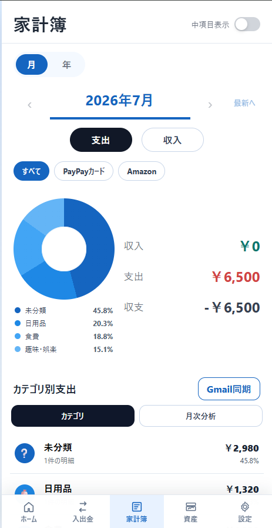
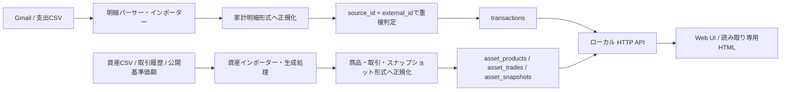

# mfblue-local-budget

Gmail通知とCSVから支出明細・資産データを取り込み、ローカルSQLiteで確認する家計簿アプリです。支出明細と資産はそれぞれの形式へ正規化し、再取り込み可能な保存処理、ローカルHTTP API、Web UIを組み合わせています。

[](https://github.com/misaka310/mfblue-local-budget/actions/workflows/ci.yml)

## 現在のサンプル画面



## 30秒で分かる特徴

- Gmail通知とCSVから、支出・資産データを取り込む。
- データはローカルSQLite、画面はローカルWeb UIで完結する。
- Gmailの権限は読み取り専用の `gmail.readonly`。OAuthトークンはOSの資格情報保管領域に保存する。
- 外部AI分析が停止しても、家計簿の保存・API・閲覧機能は使い続けられる。

## Gmail認証なしで試す

Windowsでリポジトリ直下から次を実行します。サンプル明細を投入してUIを起動します。

```cmd
start_sample_mfblue.cmd
```

成功すると、`http://127.0.0.1:8765` にサンプルデータの家計簿画面が表示されます。個別のセットアップ手順は [セットアップ](docs/SETUP.md) を参照してください。

## データフロー



詳細は [アーキテクチャとデータフロー](docs/ARCHITECTURE.md) と [データライフサイクル](docs/DATA_LIFECYCLE.md) にまとめています。

## セキュリティ設計

- Gmail本文全文や商品名は保存せず、日付・店名・金額・分類・Gmail message IDなど必要最小限を保存します。
- OAuthクライアントJSON、トークン、SQLite DB、実明細CSV、ログはGit管理しません。
- サーバーは既定で `127.0.0.1` にのみバインドします。

詳細は [セキュリティ方針](docs/SECURITY.md) を参照してください。

## 対応している入力元

支出明細と資産データは別々に正規化・upsertし、保存後はローカルSQLite、API、Web UIという共通基盤で扱います。

- 支出明細: GmailのPayPayカード利用通知、GmailのAmazon注文通知、PayPayカードCSV、Amazon注文履歴CSV
- 資産: 証券資産CSV、資産取引履歴CSV、公開基準価額

家計明細は `source_id + external_id`、資産は商品・月・取引内容に応じたキーで再取り込みを処理します。任意サービスを設定だけで扱える汎用プラグインAPIは実装していません。

## 任意機能

- [Codex App Server分析](docs/SETUP.md#codex-app-serverによる分析): ローカルバックエンドを経由する月次・年間分析。停止時も家計簿本体は使えます。
- [読み取り専用HTMLエクスポート](docs/EXPORT.md): オフライン閲覧用の単一HTMLを書き出します。

CSVごとの詳細な取り込みオプションは [入力ガイド](docs/IMPORTS.md)、資産履歴の生成・基準価額取得は [資産履歴](docs/ASSET_HISTORY.md) を参照してください。

## 制約

- PayPayカードは通知メールを取り込む方式であり、カード会社の確定請求明細そのものではありません。
- Amazonは注文確定・注文確認メール、または注文履歴CSVを対象とします。メール形式の変更などで取り込みに失敗する場合は `import_errors` を確認します。
- 外部AI分析は任意機能であり、ローカル専用のCodex App Serverを別途起動した場合だけ利用できます。

## テスト

```powershell
python run_tests_with_path.py
node --check frontend/app-core.js
node --check frontend/app-assets.js
node --check frontend/app-budget.js
node --check frontend/app-analysis.js
node --check frontend/app-bootstrap.js
node --check frontend/readonly_app.js
```

GitHub ActionsはWindows上で同じPythonテストとJavaScript構文確認を実行し、Gmail認証・OAuth JSON・実DB・外部金融API・Codex App Serverを必要としません。

## 詳細ドキュメント

- [セットアップ](docs/SETUP.md)
- [アーキテクチャとデータフロー](docs/ARCHITECTURE.md)
- [データライフサイクル](docs/DATA_LIFECYCLE.md)
- [入力ガイド](docs/IMPORTS.md)
- [読み取り専用HTMLエクスポート](docs/EXPORT.md)
- [デモの撮影手順](docs/DEMO.md)

## License

MIT License. See [LICENSE](LICENSE).
