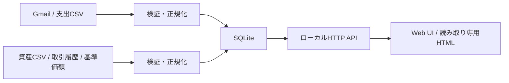

# Local Finance Dashboard

[](https://github.com/misaka310/local-finance-dashboard/actions/workflows/ci.yml)
[](https://github.com/misaka310/local-finance-dashboard/actions/workflows/pages.yml)

Gmail通知とCSVから支出・資産データを取り込み、ローカルSQLiteで一元管理するWindows向け家計・資産ダッシュボードです。再取り込み可能な正規化処理、ローカルHTTP API、Web UIを組み合わせています。

[合成データの公開デモを見る](https://misaka310.github.io/local-finance-dashboard/)


## 主な機能

- Gmail通知とCSVから支出明細を取り込み、`source_id + external_id`で重複を防止
- 証券資産CSV、取引履歴CSV、公開基準価額から資産履歴を管理
- 支出・資産をローカルSQLite、HTTP API、Web UIで一元表示
- 読み取り専用の単一HTMLを書き出し、オフライン閲覧
- 任意のCodex App Server分析が停止しても、保存・API・閲覧機能を継続

## セットアップ

### 公開デモ

実データ・Gmail認証・インストールなしでブラウザから確認できます。デモ内の金額、店舗、資産はすべて合成データです。

### ローカル実行

Windowsでリポジトリを取得し、次を実行します。

```cmd
start_sample_dashboard.cmd
```

初回セットアップ、合成サンプルの投入、UI起動までを順番に行い、通常は `http://127.0.0.1:8765` を開きます。

## 使い方

画面下部の「家計簿」と「資産」を切り替え、期間・口座・カテゴリ別の集計と明細を確認します。実データを取り込む場合は、[セットアップ手順](docs/SETUP.md)に従ってGmail認証またはCSV取り込みを設定します。

## 必要環境

- Windows 10 / 11
- Python 3.11以上
- Chromium系ブラウザ
- Gmail取り込みを使う場合のみ、Google OAuthデスクトップクライアント

セットアップとGmail認証は[セットアップ手順](docs/SETUP.md)を参照してください。

## 対応入力

- 支出: PayPayカード利用通知、Amazon注文通知、PayPayカードCSV、Amazon注文履歴CSV
- 資産: 証券資産CSV、資産取引履歴CSV、公開基準価額

任意サービスを設定だけで追加できる汎用プラグイン方式ではありません。対応形式ごとに検証・正規化してからSQLiteへupsertします。

## データフロー



詳細は[アーキテクチャ](docs/ARCHITECTURE.md)と[データライフサイクル](docs/DATA_LIFECYCLE.md)にあります。

## プライバシーと安全性

- Gmail権限は読み取り専用の `gmail.readonly`
- Gmail本文全文やAmazonの商品名は保存しない
- OAuthトークンはOSの資格情報保管領域へ保存
- OAuthクライアントJSON、トークン、SQLite DB、実CSV、ログはGit管理外
- ローカルサーバーは既定で `127.0.0.1` のみにバインド

詳細は[セキュリティ方針](docs/SECURITY.md)を参照してください。

## 制限事項

- Windows以外のローカル実行は未検証です。
- PayPayカード通知は確定請求明細そのものではありません。
- メールやCSVの形式変更により、取り込み処理の更新が必要になる場合があります。
- Codex App Server分析は任意機能で、別途ローカル起動した場合だけ利用できます。
- 公開デモは読み取り専用です。同期、編集、分析、基準価額更新は実行しません。

## 検証

```powershell
python run_tests_with_path.py
python scripts/build_public_demo.py --output _site/index.html
```

GitHub ActionsではPythonテスト、JavaScript構文確認、合成データデモ生成をWindows上で実行します。Gmail認証、OAuth JSON、実DB、外部金融API、Codex App Serverは必要ありません。

## ドキュメント

- [セットアップ](docs/SETUP.md)
- [入力ガイド](docs/IMPORTS.md)
- [資産履歴](docs/ASSET_HISTORY.md)
- [読み取り専用HTML](docs/EXPORT.md)
- [運用](docs/OPERATIONS.md)

## License

MIT License. See [LICENSE](LICENSE).
