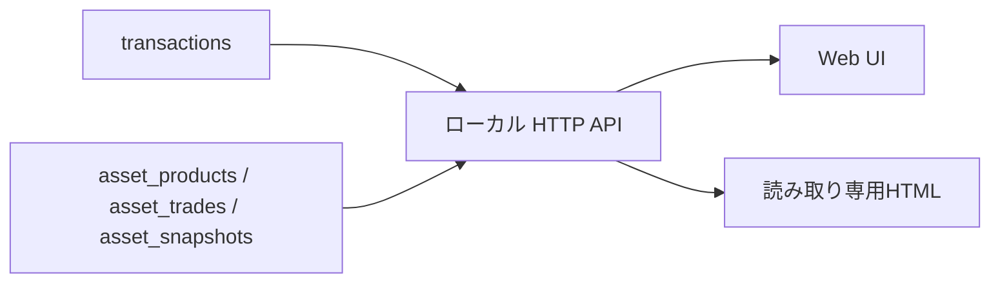
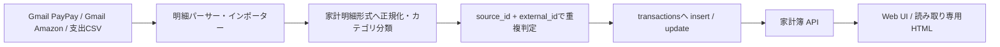
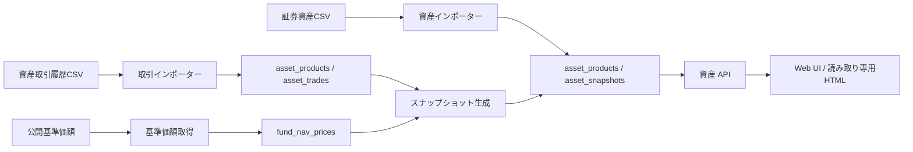
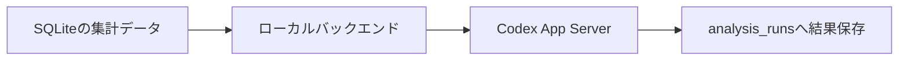

# アーキテクチャとデータフロー

## 共通基盤

家計明細系と資産系は異なるデータモデル・重複処理を持ちます。両者に共通するのは、ローカルSQLite、ローカルHTTP API、静的Web UI、Git管理外の実データ、再取り込みを考慮したupsert設計です。

## 家計明細フロー

対象入力は、GmailのPayPayカード利用通知・Amazon注文通知、PayPayカードCSV、Amazon注文履歴CSVです。各パーサー・インポーターは家計明細形式へ正規化し、カテゴリ分類はこの系統でのみ行います。

`transactions` は `UNIQUE(source_id, external_id)` を持ちます。PayPayメールはGmail message IDを識別子に使い、Amazonメールは取得できる場合に注文番号を優先します。詳細は [データライフサイクル](DATA_LIFECYCLE.md) を参照してください。

## 資産フロー

対象入力は、証券資産CSV、資産取引履歴CSV、公開基準価額です。資産CSVは商品とスナップショットへ、取引履歴CSVは商品と取引へ、公開基準価額は基準価額データへ正規化されます。資産系に家計明細のカテゴリ分類や `source_id + external_id` は適用しません。

商品は名称・証券会社・口座区分で識別し、名称の表記ゆれは正規化して既存商品を探します。スナップショットは主に `asset_id + period_month` で更新します。取引は日付・商品・証券会社・口座区分・取引種別・数量・単価・金額・入力元の組み合わせで重複を防ぎます。実測の資産スナップショットは生成値より優先します。

## 分析は任意経路

Codex App Serverは家計簿本体と独立した、ローカルで起動する任意の分析経路です。ブラウザはApp Serverへ直接接続せず、ローカルバックエンドを経由します。

Codex App Serverが停止している場合は分析要求だけが失敗します。SQLiteへの保存、ローカルHTTP API、家計簿UI、読み取り専用HTMLは利用可能なままです。

## モジュール責務

- `src/mfblue/db_schema.py`: SQLiteスキーマ作成と既存DBのマイグレーション
- `src/mfblue/db_budget.py`: 家計明細・カテゴリ・期間集計とトランザクションupsert
- `src/mfblue/db_assets.py`: 資産商品・取引・スナップショット・成績集計
- `src/mfblue/sync_gmail.py`: Gmailソースの選択、パース、識別子移行、取り込み
- `src/mfblue/import_*_csv.py`: CSVごとの検証・正規化・取り込み
- `src/mfblue/generate_asset_snapshots.py`: 取引履歴と基準価額からの資産スナップショット生成
- `src/mfblue/api_routes.py` / `src/mfblue/server.py`: ローカルHTTP APIと静的UI配信
- `frontend/`: ビルド工程を持たない静的Web UI
